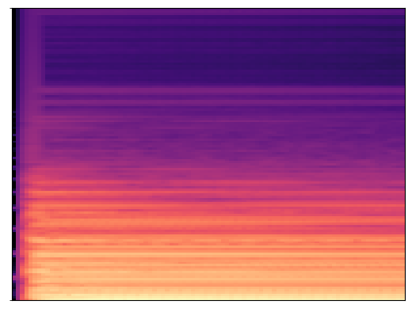

# Music-Pitch-Recognition-by-CNN

_Project assignment of Deep Learning course in Taiwan, NDHU CSIE_
---
## Assignment descriptions
In this assignment, you are required to recognize the scale (音階) of music sounds. From each music sound, we have extracted the mel-cepstrum feature, which can be represented as a 2-D image, for you. You can get an image dataset of the extracted mel-cepstrum features from http://web.csie.ndhu.edu.tw/ccchiang/Data/music_train.zip for training your model. For each image, its corresponding scale (音階) is labeled with a number ranging between 0 and 87. The file http://web.csie.ndhu.edu.tw/ccchiang/Data/truth.txt gives you the labels for all training images. You can use the labels in your model training. To test your network model, here is the test dataset (http://web.csie.ndhu.edu.tw/ccchiang/Data/music_test.zip). All you need to do is to build a CNN to learn the training data and test the CNN using the testing data. You have to output the recognized scale for each testing image and prepare the outputs as a 'output.csv' file by following the sample format given in the "Data" page (https://www.kaggle.com/c/pitch-recog/data). Once the 'output.csv' is ready, submit it to the Kaggle through https://www.kaggle.com/c/pitch-recog/submit. Then, Kaggle will evaluate your recognition accuracy immediately. You can resubmit your result when you get an improved one. Eventually, only the submission with the best accuracy among your submissions will be counted as your credit for this assignment.

You can design a convolutional neural network (CNN) to do the recognition task. To attain a higher recognition accuracy, you can design any network architecture you like for the CNN.

P.S.: You may need to learn how to read each image as a numpy array and then convert it into a PyTorch tensor. To this end, the OpenCV package (https://pypi.org/project/opencv-python/) is recommended.

### File-Descriptions
* train_truth.csv - the labels corresponding to all training image files
* sample_truth.csv - a sample file for preparing your submission (just for giving you the correct format guidance of your submission file.

### Data fields
* image filename - the filename of the image (String)
* category label - the label of the image (Integer)

